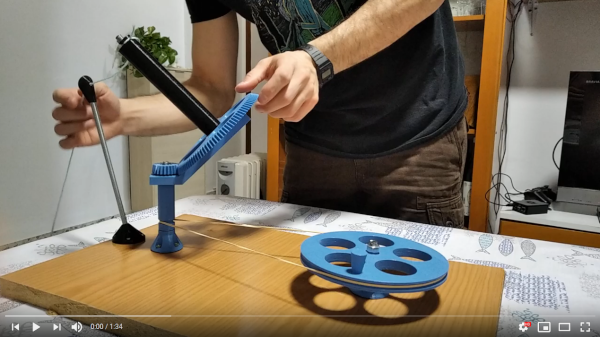
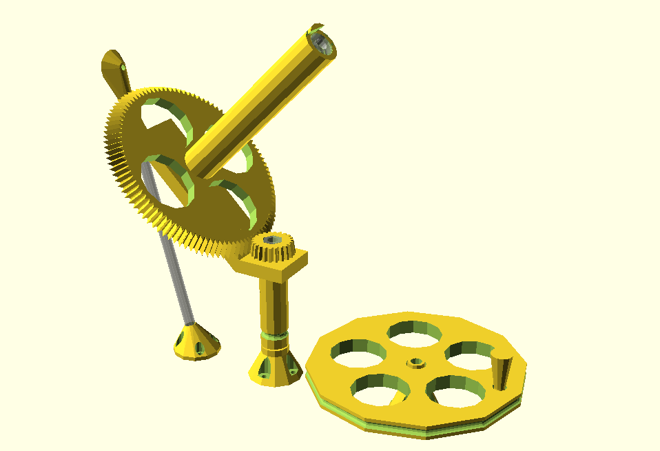
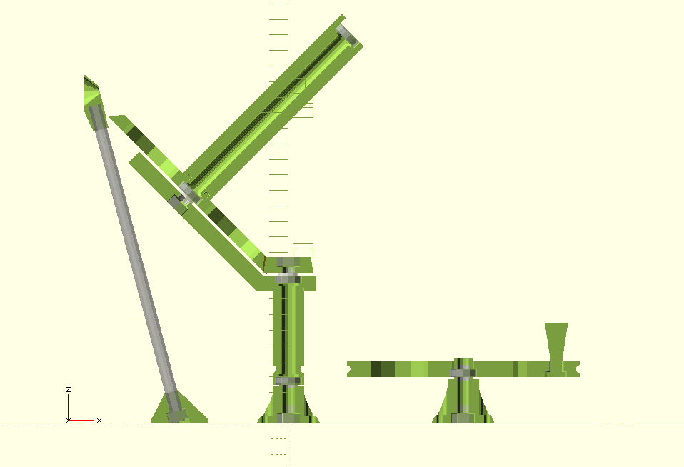
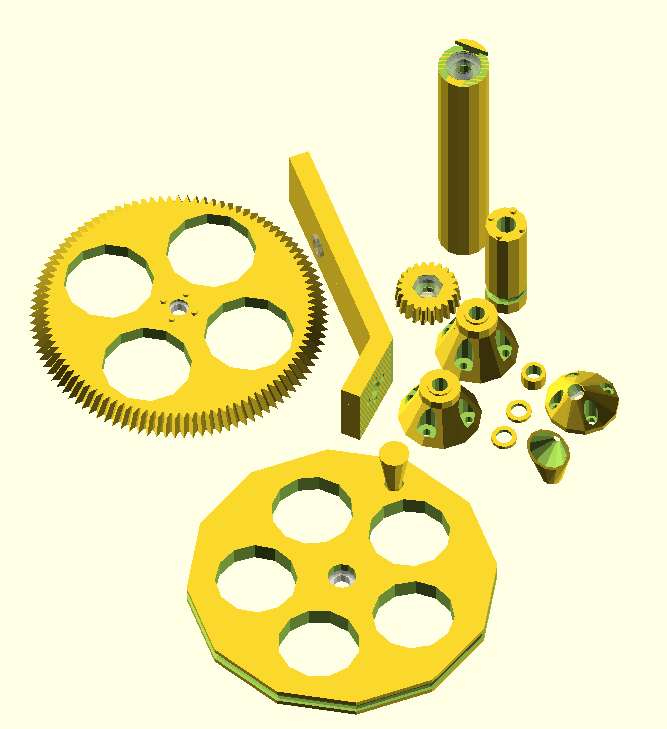

Wool Winder
===========

This project consists in a series of 3D printed pieces to assembly a wool
winder. It is based on a couple of existing projects and commercial products
[1][2][3].

All the pieces are designed in order to ease the printing process. For example,
supports are not needed for any of the pieces.

The whole structure was designed in [OpenScad](https://www.openscad.org/) and there is a lot of customizable
parameters, like the gears size and angle, the bearing and threading rod radius, the
screw holes radius, etc. All these parameters can be found at the header of the
`winder.scad`.

Generation
==========
The easiest way to generate all the pieces is by using the provided makefile. After
launching the `make` command, you should find all the`*.stl` files inside the folder
`stl/`. There is an "special" `all.stl` which contains all the pieces
spread in a plane. There is another make target, `make images`, to generate a
folder with two images for each piece, one normal preview render and another
cross-section render.

You can also open `winder.scad` with OpenScad, go to the end of the file,
select the assembly module you want to generate (the ones in capitals:
`BIG_GEAR()`, `CRANK()`, `POLE()`, etc), or generate the `WINDER_SPREAD()`
module, which contains all the pieces. When using this method, **do not forget**
to hit the render button before exporting the `*.stl` in order to get a full
resolution model.

  

Guide threaded rod length
-------------------------
The length of the threaded rod for the thread guide is calculated, based on the
configured parameters, in order to put the guide at the same height of the spinning
center of the spindle.

You can find this length using the following command: `make guide_length`, or
printed in the command window of OpenScad.

Additional BoM
==============
The only not printed pieces you need for the assembly are:

* **threaded rod**: 1 m should be more than enough
* **nuts**: 7
* **bearings**: 5

You can choose the dimensions you want (i.e. bearing diameter and rod metric)
and adjust them in the configuration parameters at the top of `winder.scad`.

Assembly
========
The assembly is quite straightforward. If you take a look on the cross-section
model into OpenScad (the WINDER_SPREAD() module) and see the sample video, you
should have no problem building it by yourself.

If you perceive that the nuts unscrews with the vibrations, you may use **self-locking nuts**
or apply a bit of **nail polish** to the screw to fix it.

TODO
====

* Add a counterweight
* Support timing belt based transmission
* Support double bearing shaft for the crank

License
=======
This project is licensed under the
[GNU GPL 3.0 license](https://www.gnu.org/licenses/gpl-3.0.txt)

This project also use a **slightly modified** library made by **GregFrost** and
named **Parametric Involute Bevel and Spur Gears** for generating the bevel
gears. This library is licensed under
[GNU LGPL 2.1](https://www.gnu.org/licenses/old-licenses/lgpl-2.1.txt),
you can find a copy of this license in `LICENSE.gears.txt`. You could find the
original file here: http://www.thingiverse.com/thing:3575

References
==========
* [1]: Homemade wool winder:   https://www.youtube.com/watch?v=nJKxa9mhLuI&t=685s
* [2]: 3D printed wool winder: https://www.thingiverse.com/thing:13816
* [3]: Commercial wool winder:  https://www.youtube.com/watch?v=wf7lT6OYEQ0&t=69s
